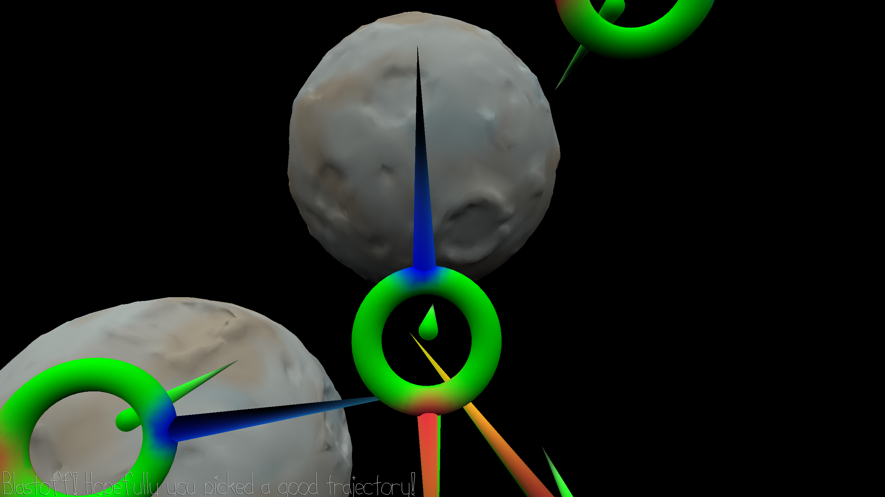

# Echo

Author: Matei Budiu

Design: Echo is a game based on echolocation. The player must wisely use a limited number of pings to locate and avoid asteroids.

Screen Shot:

How To Play:

This game is best played with stereo audio and headphones.

You can look around with your cursor to position your head.

Press space to begin the ping process. Then, you can roll your head around to make better use of stereo audio. 
When you are satisfied with your position, press space again to send out a ping. The ping will reflect off hidden
asteroids, and it is your job to get a sense of where they are with your limited 5 pings.

Pings will be loudest from obstacles near your forward path at the moment, and will be directional based on where
the asteroid is relative to you.

If you want to listen to your old pings again, press the keys 1-5 to position yourself and space to listen again.
This will not consume an extra ping cost.

Once you are confident in your ability to navigate the space safely, press enter to blastoff. The asteroids will become
visible, and you will see whether you chose wisely.

If you crash, the game will load a level with one less asteroid than before, and if you make it through, you will
face a level with one more asteroid than before.

This game was built with [NEST](NEST.md).
